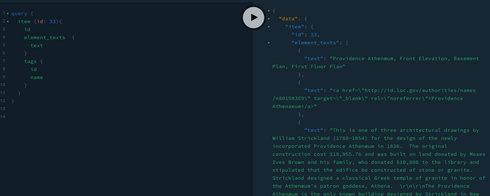

<!-- PROJECT LOGO -->
<br />
<div align="center">
  <a href="https://github.com/3rendan/GraphAth">
    
  </a>

<h3 align="center">GraphAth</h3>

  <p align="center">
    A GraphQL express server to parse the RESTful API served by the digital art repository for the Providence Athenaeum managed with an Omeka CMS
    <br />
  </p>
</div>


<!-- TABLE OF CONTENTS -->
<details>
  <summary>Table of Contents</summary>
  <ol>
    <li>
      <a href="#about-the-project">About The Project</a>
      <ul>
        <li><a href="#built-with">Built With</a></li>
      </ul>
    </li>
    <li>
      <a href="#getting-started">Getting Started</a>
      <ul>
        <li><a href="#prerequisites">Prerequisites</a></li>
        <li><a href="#installation">Installation</a></li>
      </ul>
    </li>
    <li><a href="#usage">Usage</a></li>
    <li><a href="#roadmap">Roadmap</a></li>
    <li><a href="#contributing">Contributing</a></li>
    <li><a href="#license">License</a></li>
    <li><a href="#contact">Contact</a></li>
    <li><a href="#acknowledgments">Acknowledgments</a></li>
  </ol>
</details>

### Built With

* [React.js](https://reactjs.org/)
* [Express-GraphQL](https://graphql.org/graphql-js/express-graphql/)
* [styled components](https://styled-components.com/)
* [Apollo Client](https://www.apollographql.com/docs/react/)
* [Bootstrap](https://getbootstrap.com)

<p align="right">(<a href="#top">back to top</a>)</p>


<!-- GETTING STARTED -->
## Getting Started

This is a basic graphQL server built to query the API from endpoint http://digital.provath.org/api. The goal is to build it out so that's it's fully functional and deploy it to Heroku.

### Prerequisites

To use this with an API endpoint querying an Omeka CMS server is needed.


### Installation

1. Get a free API Key at [https://example.com](https://example.com)
2. Clone the repo
   ```sh
   git clone https://github.com/3rendan/GraphAth.git
   ```
3. Install NPM packages
   ```sh
   npm install
   ```
4. Enter your API in `config.js`
   ```js
   const API_ENDPOINT = 'ENTER YOUR API';
   ```

<p align="right">(<a href="#top">back to top</a>)</p>


<!-- USAGE EXAMPLES -->
## Usage

GraphQL screenshot



<!-- ROADMAP -->
## Roadmap

- Querying the endpoint and pairing items with images based upon item id.
- [] Feature 2
- [] Feature 3
    - [] Nested Feature

See the [open issues](https://github.com/3rendan/GraphAth/issues) for a full list of proposed features (and known issues).

<p align="right">(<a href="#top">back to top</a>)</p>


<!-- CONTRIBUTING -->
## Contributing

Contributions are what make the open source community such an amazing place to learn, inspire, and create. Any contributions you make are **greatly appreciated**.

If you have a suggestion that would make this better, please fork the repo and create a pull request. You can also simply open an issue with the tag "enhancement".
Don't forget to give the project a star! Thanks again!

1. Fork the Project
2. Create your Feature Branch (`git checkout -b feature/AmazingFeature`)
3. Commit your Changes (`git commit -m 'Add some AmazingFeature'`)
4. Push to the Branch (`git push origin feature/AmazingFeature`)
5. Open a Pull Request

<p align="right">(<a href="#top">back to top</a>)</p>


<!-- LICENSE -->
## License

Distributed under the MIT License. See `LICENSE.txt` for more information.

<p align="right">(<a href="#top">back to top</a>)</p>


<!-- CONTACT -->
## Contact

Brendan Ryan - brendan.ryan@pm.me@pm.me.com

Project Link: [https://github.com/3rendan/GraphAth](https://github.com/3rendan/GraphAth)

## About The Project

[![GraphAth][product-screenshot]](https://example.com)

Here's a blank template to get started: To avoid retyping too much info. Do a search and replace with your text editor for the following: `3rendan`, `GraphAth`, `twitter_handle`, `brendan-r-ryan`, `brendan.ryan@pm.me`, `pm.me`, `GraphAth`, `A graphQL express server to parse the RESTful API served by the digital art repository for the Providence Athenaeum managed with an Omeka CMS`
